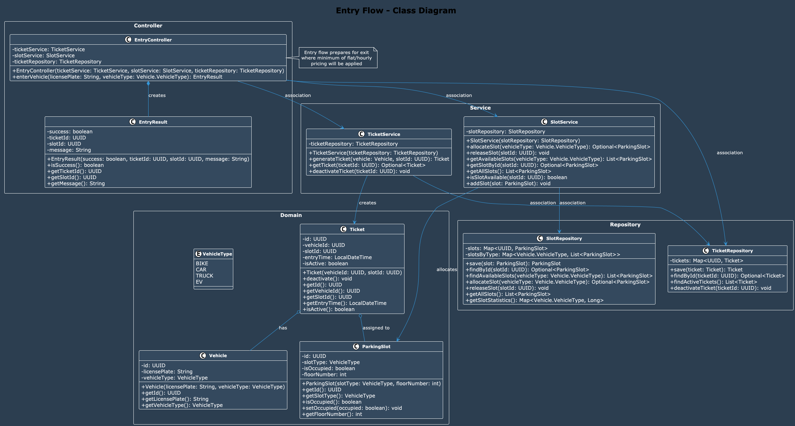
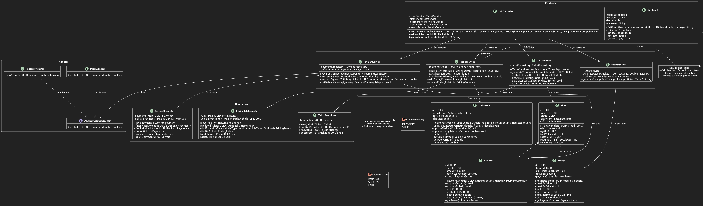
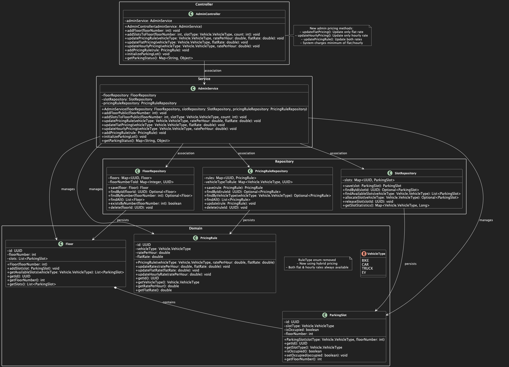

# PARKING LOT LLD DESIGN STEPS

## STEP-1: CLARIFY REQUIREMENTS

### FUNCTIONAL REQUIREMENTS:

**Entry Flow:**
- Vehicle arrives at the gate
- Generate ticket and assign slot based on vehicle type
- Mark slot as occupied
- Return EntryResult with success/failure status

**Exit Flow:**
- User presents ticket at exit
- Calculate fee based on pricing rules (minimum of flat and hourly pricing)
- Process payment through payment gateway
- Release slot and generate receipt
- Return ExitResult with success/failure status

**Admin Configurations:**
- Add/Edit/Delete Floors and Slots
- Define pricing rules based on vehicle type (both flat and hourly rates)
- Update flat and hourly pricing for vehicle types
- View current parking status

(You can think of cases like some server failure, where we may need a human to override instead of automated gates working by themselves)

### NON-FUNCTIONAL REQUIREMENTS:

- Scalability: Must support multiple parking lots and thousands of slots
- Consistency: Strong consistency for slot allocation and release
- Availability: High availability for Entry/Exit even during payment gateway failure
- Latency: Low latency (<500ms) for ticket generation and exit processing
- Extensibility: Easily add new vehicle types, pricing strategies, or gateways
- Security: Role-based access for admin actions

### EDGE CASES:

- Payment failure during exit - retry and hold slot
- Ticket lost - allow admin override
- Clock skew - system time validation
- Slot state mismatch - periodic reconciliation

---

## STEP-2: IDENTIFY CORE ENTITIES

1. **Vehicle**
   - id: UUID [PK]
   - licensePlate: String
   - vehicleType: Enum (BIKE, CAR, TRUCK, EV)

2. **ParkingSlot**
   - id: UUID [PK]
   - slotType: Enum (BIKE, CAR, TRUCK, EV)
   - isOccupied: boolean
   - floorNumber: int

3. **Floor**
   - id: UUID [PK]
   - floorNumber: int
   - slots: List<ParkingSlot>

4. **Ticket**
   - id: UUID [PK]
   - vehicleId: UUID [FK -> Vehicle.id]
   - slotId: UUID [FK -> ParkingSlot.id]
   - entryTime: Timestamp
   - isActive: boolean

5. **Receipt**
   - id: UUID [PK]
   - ticketId: UUID [FK -> Ticket.id]
   - exitTime: Timestamp
   - totalFee: Double
   - paymentStatus: Enum (PENDING, SUCCESS, FAILED)

6. **PricingRule**
   - id: UUID [PK]
   - vehicleType: Enum
   - ratePerHour: Double
   - flatRate: Double
   - ruleType: Enum (FLAT, HOURLY)

7. **Payment**
   - id: UUID [PK]
   - ticketId: UUID [FK -> Ticket.id]
   - amount: Double
   - gateway: Enum (RAZORPAY, STRIPE)
   - status: Enum (PENDING, SUCCESS, FAILED)

### DTO's

8. **EntryResult**
   - success: boolean
   - ticket: Ticket (if successful)
   - message: String

9. **ExitResult**
   - success: boolean
   - receipt: Receipt (if successful)
   - message: String

---

## STEP-3: DISCUSS INTERACTION FLOW

1. **Entry Flow:**
   Driver enters, gets a slot, get's a ticket

2. **Exit Flow:**
   Driver exits, shows the ticket, price computed (minimum of flat and hourly pricing),
   pay's the amount (with retries if it fails),
   get the receipt, slot released, ticket deactivated to avoid multiple entry

3. **Admin Flow:**
   Admin requests to add floor, add slots, or update pricing

---

## STEP-4: DISCUSS CLASS STRUCTURES AND RELATIONSHIPS

### ARCHITECTURE LAYERS:
Client/UI -> Controller Layer (HTTP/API) -> Service Layer -> Repository Layer -> Domain Layer

### CONTROLLERS:
1. **EntryController**
   - EntryResult enterVehicle(String licensePlate, VehicleType vehicleType)
2. **ExitController**
   - ExitResult exitVehicle(UUID ticketId)
3. **AdminController**
   - void addFloor(int floorNumber)
   - void addSlot(int floorNumber, VehicleType slotType)
   - void updatePricing(VehicleType vehicleType, double ratePerHour, double flatRate)
   - void updateFlatPricing(VehicleType vehicleType, double flatRate)
   - void updateHourlyPricing(VehicleType vehicleType, double ratePerHour)

### SERVICES:
1. **TicketService**
   - Ticket generateTicket(Vehicle vehicle, ParkingSlot slot)
   - Ticket getTicket(UUID ticketId)
2. **SlotService**
   - ParkingSlot allocateSlot(VehicleType vehicleType)
   - void releaseSlot(UUID slotId)
3. **PricingService**
   - double calculateFee(Ticket ticket) // Returns minimum of flat and hourly pricing
4. **PaymentService**
   - boolean processPayment(UUID ticketId, double amount)
5. **ReceiptService**
   - Receipt generateReceipt(Ticket ticket, double fee, boolean paymentSuccess)
6. **AdminService**
   - void addFloor(int floorNumber)
   - void addSlot(int floorNumber, VehicleType slotType)
   - void updatePricing(VehicleType vehicleType, double ratePerHour, double flatRate)
   - void updateFlatPricing(VehicleType vehicleType, double flatRate)
   - void updateHourlyPricing(VehicleType vehicleType, double ratePerHour)

### REPOSITORIES:
1. **TicketRepository**
   - void save(Ticket ticket)
   - Ticket findById(UUID ticketId)
   - List<Ticket> findActiveTickets()
   - void deactivateTicket(UUID ticketId)
2. **SlotRepository**
   - void save(ParkingSlot slot)
   - ParkingSlot findById(UUID slotId)
   - ParkingSlot findAvailableSlot(VehicleType vehicleType)
3. **FloorRepository**
   - void save(Floor floor)
   - Floor findByFloorNumber(int floorNumber)
4. **PricingRuleRepository**
   - void save(PricingRule rule)
   - PricingRule findByVehicleType(VehicleType vehicleType)
5. **PaymentRepository**
   - void save(Payment payment)
   - Payment findByTicketId(UUID ticketId)

### INTERFACES:
1. **PaymentGatewayAdapter**
   - boolean pay(UUID ticketId, double amount)

### IMPLEMENTATIONS:
1. RazorpayAdapter implements PaymentGatewayAdapter
2. StripeAdapter implements PaymentGatewayAdapter

---

## STEP-5: CORE USE CASES & METHODS

**ENTRY USE CASE:**  
enterVehicle() -> SlotService.allocateSlot() -> TicketService.generateTicket() ->
TicketRepository.save() -> return EntryResult

**EXIT USE CASE:**  
exitVehicle() -> TicketService.getTicket() -> PricingService.calculateFee() ->
PaymentService.processPayment() -> PaymentGatewayAdapter.pay() ->
SlotService.releaseSlot() -> ReceiptService.generateReceipt() -> return ExitResult

**ADMIN USE CASES:**  
addFloor() -> AdminService -> FloorRepository.save()
addSlot() -> SlotRepository.save()
updatePricing() -> PricingRuleRepository.save()

---

## STEP-6: OOP PRINCIPLES AND DESIGN PATTERNS

### DESIGN PATTERNS USED:

1. **Adapter Pattern** - to integrate with different payment gateways (Razorpay, Stripe)
2. **Repository Pattern** - for data access abstraction
3. **Service Layer Pattern** - for business logic separation

### OOP PRINCIPLES APPLIED:

1. **Interface Segregation** - separate responsibilities by interface (PaymentGatewayAdapter)
2. **Dependency Inversion** - services depend on interfaces, not concrete implementations
3. **Single Responsibility** - each class has one clear purpose
4. **Open/Closed** - easy to extend with new vehicle types, pricing strategies, payment gateways
5. **Encapsulation** - domain objects encapsulate their data and behavior

---

## STEP-7: HANDLE EDGE CASES

### EDGE CASE SOLUTIONS:

1. Exit without ticket - admin override functionality through AdminController
2. Payment failed - PaymentGatewayAdapter returns boolean, handle failure in PaymentService
3. Vehicle type mismatch - verify at entry and exit through SlotService
4. Time mismatch - use system clock consistently across all services
5. Slot inconsistency - run periodic reconciliation service

### IMPLEMENTATION STRATEGIES:

- **Exit without ticket:** special admin endpoints for manual operations through AdminController
- **Payment Retry Logic:** PaymentService handles boolean results from PaymentGatewayAdapter
- **Data Validation:** Validate vehicle type compatibility at entry/exit through SlotService
- **Clock Synchronization:** Use centralized time service across all timestamp operations
- **Reconciliation Service:** Background job to fix slot state inconsistencies

---

## STEP-8: CLASS DIAGRAMS AND PACKAGE STRUCTURE

1. Association - I work with you
2. Aggregation - I have you, but you are not mine.
3. Composition - You are mine and only mine.

### Entry Flow Class Diagram

### Exit Flow Class Diagram

### Admin Flow Class Diagram

---

## STEP-9: FUTURE REQUIREMENTS

### FUTURE FUNCTIONAL REQUIREMENTS:

1. **Multi-Location Support**
   - Support multiple parking lots across different cities
   - Centralized admin dashboard for all locations
   - Location-specific pricing and rules

2. **Advanced Payment Features**
   - Digital wallet integration
   - Subscription-based parking passes
   - Corporate billing and invoicing
   - Multiple payment methods (cards, UPI, digital wallets)

3. **User Management**
   - User registration and profiles
   - Vehicle registration and management
   - Parking history and analytics
   - Loyalty programs and rewards

4. **Reservation System**
   - Pre-book parking slots
   - Time-based reservations
   - Premium spot reservations
   - Cancellation and refund handling

5. **Real-time Features**
   - Live slot availability updates
   - Mobile app for ticket management
   - QR code generation and scanning
   - Push notifications for reminders

6. **Analytics and Reporting**
   - Revenue analytics and forecasting
   - Occupancy rate analysis
   - Peak hour identification
   - Customer behavior insights
