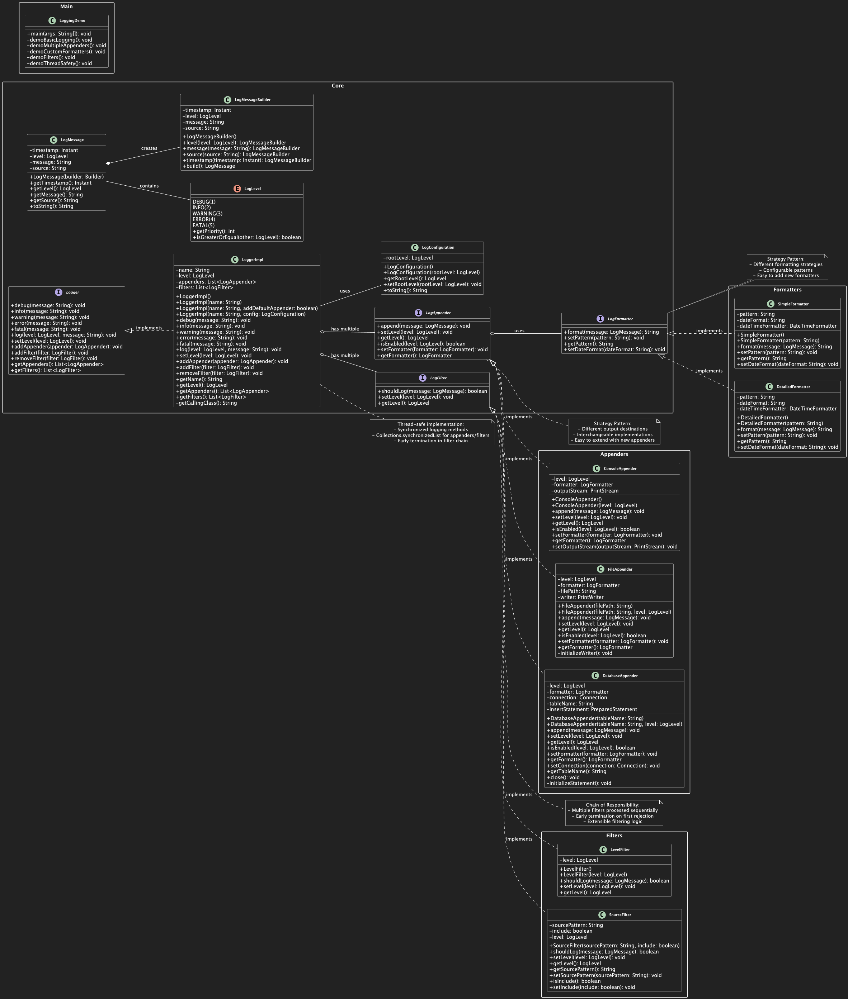

# LOGGING FRAMEWORK LLD DESIGN STEPS

> [!NOTE]
> **Introduction: System vs. Framework**
> In this design, we are building a **Logging Framework**, which differs from standard systems we've built previously.
> * **Standard Systems:** Typically have a layered architecture (Controller -> Service -> Repository) dealing with specific application logic.
> * **Frameworks:** Follow the principle of exposing a **simple structure** to the user while hiding a **complex system** underneath. The user interacts with the simple interface to get their work done, without needing to understand the underlying complex logic handling the actual job.

## STEP-1: DISCUSS FUNCTIONAL REQUIREMENTS

**1. Log Levels with Priority System:**
- Support 5 log levels: DEBUG, INFO, WARNING, ERROR, FATAL
- Each level has a priority (DEBUG=1, INFO=2, WARNING=3, ERROR=4, FATAL=5)
- Only log messages with priority >= configured level
- Example: If level is set to WARNING, only WARNING, ERROR, and FATAL messages are logged

```java
logger.setLevel(LogLevel.WARNING);
logger.debug("This won't be logged");    // Skipped
logger.info("This won't be logged");     // Skipped
logger.warning("This will be logged");   // Logged
logger.error("This will be logged");     // Logged
```

**2. Log Message Structure:**
- Each log message contains: timestamp, level, message text, and optional source
- Timestamp: When the log was created
- Level: Severity of the message
- Message: What happened
- Source: Which class/method generated the log (optional)

```java
// Creates: [2024-01-15 10:30:45] [ERROR] [PaymentService.processPayment] - Payment failed for user 123
logger.error("Payment failed for user {}", userId);
```

**3. Multiple Output Destinations:**
- Console: Display logs in terminal/console (for development)
- File: Save logs to a file (for production)
- Database: Store logs in database (for analysis)
- Same log message can go to multiple destinations simultaneously

**4. Configuration System:**
- Set logging level for entire application
- Choose which output destinations to use
- Configure formatting rules
- Simple configuration without complex filtering

**5. Thread Safety:**
- Multiple threads can log simultaneously without data corruption
- No lost or mixed-up log messages
- Thread-safe operations for all logging components

**6. Extensibility:**
- Easy to add new output destinations (email, network, cloud storage)
- Easy to add new log levels if needed
- Easy to add custom formatting

**7. Message Formatting:**
- Customize how log messages appear in output
- Control timestamp format, level display, and message layout
- Different formats for different destinations

---

## STEP-2: IDENTIFY CORE ENTITIES

1. **LogLevel**
   - Enum (DEBUG, INFO, WARNING, ERROR, FATAL)
   - priority: int (for comparison)
   - isGreaterOrEqual(LogLevel other): boolean

2. **LogMessage**
   - timestamp: Timestamp
   - level: LogLevel
   - message: String
   - source: String (optional - class/method name)

3. **LogConfiguration**
   - rootLevel: LogLevel
   - // Simple configuration for the logging framework

---

## STEP-3: VISUALIZE INTERACTION FLOWS

1. **Basic Logging Flow:**
   Application creates log message -> Logger processes message ->
   If message passes level check -> Logger sends to output destinations ->
   Each destination writes the message

2. **Configuration Flow: (Real time)**
   Application sets LogConfiguration -> Logger updates its settings ->
   All future logs follow new configuration

3. **Multi-threaded Flow:**
   Multiple threads create log messages simultaneously ->
   Thread-safe Logger processes each request ->
   Each destination handles concurrent writes safely

4. **Formatting Flow:**
   LogMessage reaches destination -> Destination formats message ->
   Formatted message is written to output

---

## STEP-4: DISCUSS CLASS STRUCTURES AND RELATIONSHIPS

### CORE INTERFACES: (fundamental classes and interfaces)

1. **Logger**
   - void debug(String message)
   - void info(String message)
   - void warning(String message)
   - void error(String message)
   - void fatal(String message)
   - void log(LogLevel level, String message)
   - void setLevel(LogLevel level)
   - void addAppender(LogAppender appender)
   - void addFilter(LogFilter filter)
   - void removeFilter(LogFilter filter)
   - List<LogAppender> getAppenders()
   - List<LogFilter> getFilters()

2. **LogAppender**
   - void append(LogMessage message)
   - void setLevel(LogLevel level)
   - LogLevel getLevel()
   - boolean isEnabled(LogLevel level)
   - void setFormatter(LogFormatter formatter)
   - LogFormatter getFormatter()

3. **LogFormatter**
   - String format(LogMessage message)
   - void setPattern(String pattern)
   - String getPattern()
   - void setDateFormat(String dateFormat)

4. **LogFilter**
   - boolean shouldLog(LogMessage message)
   - void setLevel(LogLevel level)
   - LogLevel getLevel()

### IMPLEMENTATION CLASSES:

1. **ConsoleAppender** implements LogAppender
   - Writes to System.out/System.err based on level
   - Uses formatter to format messages before output

2. **FileAppender** implements LogAppender
   - Writes to specified file with timestamp
   - Uses formatter to format messages before writing

3. **DatabaseAppender** implements LogAppender
   - Writes to database table
   - Uses formatter to format messages before storage

4. **SimpleFormatter** implements LogFormatter
   - Default format: "[LEVEL] TIMESTAMP - MESSAGE"
   - Configurable date format and pattern

5. **DetailedFormatter** implements LogFormatter
   - Extended format: "[LEVEL] TIMESTAMP [SOURCE] - MESSAGE"
   - Includes source information when available

6. **LevelFilter** implements LogFilter
   - Filters messages based on minimum log level
   - Only allows messages with level >= configured level

7. **SourceFilter** implements LogFilter
   - Filters messages based on source/class name
   - Can include or exclude specific packages/classes

### CORE CLASSES:

1. **LogLevel**
   - Enum with priority values
   - isGreaterOrEqual(LogLevel other) method

2. **LogMessage**
   - Immutable data class
   - Builder pattern for construction

---

## STEP-5: CORE USE CASES & METHODS

**BASIC LOGGING USE CASE:**  
Application calls logger.info("message") -> LoggerImpl.log(LogLevel.INFO, "message") ->
LogMessage.Builder().level(INFO).message("message").build() ->
Check level.isGreaterOrEqual(loggerLevel) ->
For each appender: appender.isEnabled(level) -> appender.append(logMessage) ->
appender.getFormatter().format(logMessage) -> Write formatted message

**CONFIGURATION USE CASE:**  
Application calls logger.setLevel(LogLevel.WARNING) ->
LoggerImpl.setLevel(LogLevel.WARNING) ->
Future logger.log() calls use new level for filtering

**MULTI-THREADED USE CASE:**  
Thread1: logger.info("msg1") + Thread2: logger.error("msg2") ->
LoggerImpl.log() with synchronized keyword ->
Collections.synchronizedList for appenders/filters ->
Concurrent appender.append() calls -> No data corruption

**FILTERING USE CASE:**  
LoggerImpl.log() creates LogMessage ->
For each filter in filters list: filter.shouldLog(logMessage) ->
If any filter returns false -> return early (message dropped) ->
If all filters pass -> proceed to appenders

**FORMATTING USE CASE:**  
appender.append(logMessage) ->
LogFormatter formatter = appender.getFormatter() ->
String formatted = formatter.format(logMessage) ->
Write formatted string to destination (console/file/database)

---

## STEP-6: OOP PRINCIPLES AND DESIGN PATTERNS

### DESIGN PATTERNS USED:

1. **Strategy Pattern** - Different appenders (Console, File, Database) and formatters (Simple, Detailed)
2. **Chain of Responsibility Pattern** - Filter chain processing
3. **Builder Pattern** - LogMessage construction

### OOP PRINCIPLES APPLIED:

1. **Single Responsibility** - Each class has one clear purpose
2. **Open/Closed** - Easy to add new appenders without modifying existing code
3. **Liskov Substitution** - All appenders are interchangeable
4. **Interface Segregation** - Clean LogAppender interface
5. **Dependency Inversion** - Depend on LogAppender interface, not concrete implementations
6. **Encapsulation** - Internal state protected, clean public APIs

### SOLID PRINCIPLES:

1. **Single Responsibility:** Logger handles logging, Appenders handle output, Formatters handle formatting, Filters handle filtering
2. **Open/Closed:** New appenders, formatters, and filters can be added without changing existing code
3. **Liskov Substitution:** Any LogAppender, LogFormatter, or LogFilter can replace another
4. **Interface Segregation:** Each interface has only necessary methods for its responsibility
5. **Dependency Inversion:** Logger depends on LogAppender, LogFormatter, and LogFilter interfaces

---

## STEP-7: HANDLE EDGE CASES

### EDGE CASE SOLUTIONS:

1. **Multiple Threads Logging:**
   - Use synchronized methods or concurrent collections
   - Thread-safe appender implementations
   - Atomic operations for shared state

2. **Invalid Log Levels:**
   - Validation in LogLevel enum
   - Default to ERROR level for invalid inputs
   - Clear error messages

3. **File System Full:**
   - Try-catch for file operations
   - Fallback to console logging
   - Alert or exception handling

4. **Database Connection Failure:**
   - Connection pooling and retry logic
   - Fallback to file logging
   - Graceful degradation

5. **Invalid Format Patterns:**
   - Validation in formatter implementations
   - Default to simple format for invalid patterns
   - Clear error messages for pattern syntax

6. **Filter Configuration Errors:**
   - Validation of filter parameters
   - Default to accept all messages for invalid filters
   - Graceful handling of filter exceptions

---

## STEP-8: CLASS DIAGRAMS AND RELATIONSHIPS

1. **Association** - I work with you
2. **Aggregation** - I have you, but you are not mine
3. **Composition** - You are mine and only mine.


