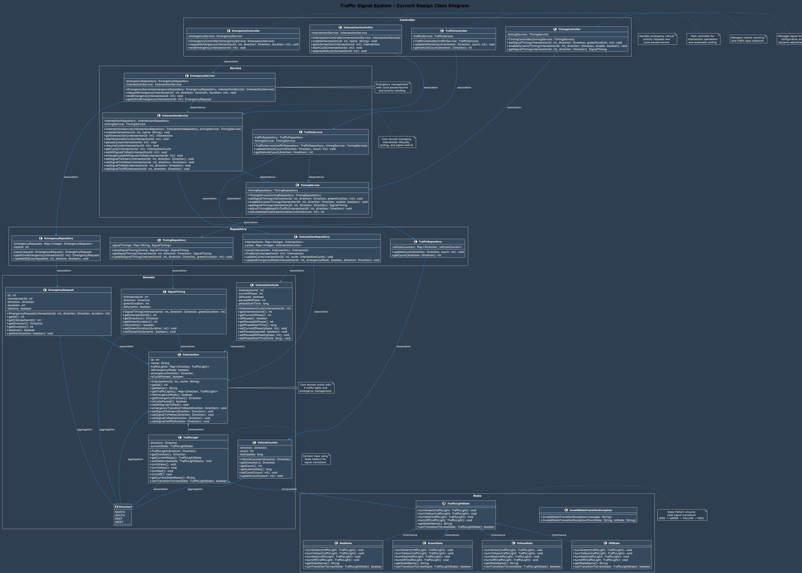

# TRAFFIC SIGNAL SYSTEM LLD DESIGN STEPS

## STEP-1: DISCUSS FUNCTIONAL REQUIREMENTS

### FUNCTIONAL REQUIREMENTS:

1. The system should control traffic signals at a single intersection (4 traffic lights as a unit)
2. The system should manage automatic cycling through phases (NORTH -> EAST -> SOUTH -> WEST)
3. The system should handle emergency vehicle priority requests by PAUSING the automatic cycle
4. During emergency: ALL signals turn RED, emergency direction gets GREEN, then resume cycle from pause
5. The system should track vehicle count at each approach
6. The system should prevent conflicting signals from being active simultaneously
7. The system should have configurable signal durations (RED, YELLOW, GREEN) for each direction
8. The system should allow dynamic adjustment of signal durations based on traffic conditions

### EDGE CASES:

- Emergency vehicle request during signal change
- Invalid signal state transitions (handled by State Pattern)
- Cycle pause/resume during emergency

---

## STEP-2: IDENTIFY CORE ENTITIES

1. **Intersection (Core Entity)**
   - id: int [PK]
   - name: String
   - trafficLights: TrafficLight[] (4 lights: NORTH, SOUTH, EAST, WEST)
   - isEmergencyMode: boolean
   - emergencyDirection: Direction (nullable)
   - isCyclePaused: boolean

2. **IntersectionCycle**
   - intersectionId: int [FK]
   - currentPhase: int (0=NORTH, 1=EAST, 2=SOUTH, 3=WEST)
   - isPaused: boolean
   - pausedAtPhase: int
   - phaseStartTime: long (timestamp)

3. **TrafficLight**
   - direction: Enum (NORTH, SOUTH, EAST, WEST)
   - currentState: TrafficLightState (State Pattern implementation)
   - // Valid transitions: RED -> GREEN -> YELLOW -> RED
   - // Invalid transitions: RED -> YELLOW, GREEN -> RED (blocked by state pattern)

4. **SignalTiming (NEW)**
   - intersectionId: int [FK]
   - direction: Enum (NORTH, SOUTH, EAST, WEST)
   - greenDuration: int (seconds)
   - isDynamic: boolean (for traffic-based adjustment)
   - // yellowDuration is a constant (3 seconds) for safety

5. **VehicleCounter**
   - direction: Enum (NORTH, SOUTH, EAST, WEST)
   - count: int
   - lastUpdate: long (timestamp)

6. **EmergencyRequest**
   - id: int [PK]
   - intersectionId: int [FK]
   - direction: Enum (NORTH, SOUTH, EAST, WEST)
   - duration: int (seconds)
   - isActive: boolean

7. **TrafficLightState (State Pattern Interface)**
   - // State interface for traffic light state management

8. **RedState (Concrete State)**
   - // Concrete state for RED traffic light

9. **GreenState (Concrete State)**
   - // Concrete state for GREEN traffic light

10. **YellowState (Concrete State)**
    - // Concrete state for YELLOW traffic light

11. **OffState (Concrete State)**
    - // Concrete state for OFF traffic light

---

## STEP-3: VISUALIZE INTERACTION FLOWS

1. **Intersection Management Flows:**  
   a) **Intersection Creation Flow:**  
      Create intersection -> Initialize 4 traffic lights -> Set default signal timings -> Start automatic cycle
   
   b) **Intersection Status Flow:**  
      Request status -> Return all signal states, cycle info, and current timings

2. **Automatic Cycle Management Flows:**  
   a) **Normal Cycle Flow:**  
      Cycle through phases: NORTH -> EAST -> SOUTH -> WEST
      Each phase: GREEN (configurable duration) -> YELLOW (configurable duration) -> RED -> Next phase
      State Pattern ensures valid transitions: RED -> GREEN -> YELLOW -> RED
   
   b) **Cycle Pause/Resume Flow:**  
      Pause cycle -> Remember current phase -> Resume from same phase

3. **Signal Timing Management Flows:**  
   a) **Timing Configuration Flow:**  
      Set signal timing -> Update SignalTiming for direction -> Apply to next cycle
   
   b) **Dynamic Timing Adjustment Flow:**  
      Traffic condition detected -> Calculate optimal timing -> Update SignalTiming -> Apply immediately or next cycle

4. **Emergency Management Flows:**  
   a) **Emergency Request Flow:**  
      Emergency request -> PAUSE cycle -> ALL signals transition to RED (following proper state sequence) ->
      Emergency direction GREEN -> Wait duration -> Resume cycle from pause
   
   b) **Emergency End Flow:**  
      End emergency -> All signals transition to RED (following proper state sequence) -> Resume cycle from paused phase

5. **Vehicle Counting Flows:**  
   a) **Count Update Flow:**  
      Vehicle detected -> Update count for direction ->
      Trigger dynamic timing adjustment if enabled (in future)
   
   b) **Count Query Flow:**  
      Request count -> Return vehicle count for direction

6. **State Transition Flows:**  
   a) **Valid State Transition Flow:**  
      TrafficLight.turnGreen() -> currentState.turnGreen(this) -> setState(new GreenState())
   
   b) **Invalid State Transition Flow:**  
      TrafficLight.turnYellow() -> currentState.turnYellow(this) -> throws InvalidStateTransitionException
   
   c) **Emergency State Transition Flow:**  
      Emergency transition -> Check current state -> Follow proper sequence (GREEN -> YELLOW -> RED) ->
      Handle each state appropriately -> Log transition sequence

---

## STEP-4: DEFINE CLASS STRUCTURES AND RELATIONSHIPS

### CONTROLLERS:

1. **IntersectionController** (Main Controller)
   - void createIntersection(int id, String name)
   - Intersection getIntersection(int intersectionId)
   - void startCycle(int intersectionId)
   - void displayStatus(int intersectionId)

2. **EmergencyController** (Emergency Management)
   - void requestEmergency(int intersectionId, Enum direction, int duration)
   - void endEmergency(int intersectionId)

3. **TrafficController**
   - void updateVehicleCount(Enum direction, int count)
   - int getVehicleCount(Enum direction)

4. **TimingController** (Timing Management)
   - void setSignalTiming(int intersectionId, Enum direction, int greenDuration)
   - void enableDynamicTiming(int intersectionId, Enum direction, boolean enable)
   - SignalTiming getSignalTiming(int intersectionId, Enum direction)

### SERVICES:

1. **IntersectionService** (Core Service)
   - void createIntersection(int id, String name)
   - Intersection getIntersection(int intersectionId)
   - void startAutomaticCycle(int intersectionId)
   - void pauseCycle(int intersectionId)
   - void resumeCycle(int intersectionId)
   - IntersectionCycle getCycle(int intersectionId)
   - void setAllSignalsToRed(int intersectionId)
   - void emergencySetAllSignalsToRed(int intersectionId)
   - void setSignalToGreen(int intersectionId, Direction direction)
   - void setSignalToYellow(int intersectionId, Direction direction)
   - void setSignalToRed(int intersectionId, Direction direction)
   - void setSignalToOff(int intersectionId, Direction direction)

2. **EmergencyService** (Core Emergency Service)
   - void requestEmergency(int intersectionId, Enum direction, int duration)
   - void endEmergency(int intersectionId)
   - EmergencyRequest getActiveEmergency(int intersectionId)

3. **TrafficService**
   - void updateVehicleCount(Enum direction, int count)
   - int getVehicleCount(Enum direction)

4. **TimingService** (Timing Management)
   - void setSignalTiming(int intersectionId, Enum direction, int greenDuration)
   - void enableDynamicTiming(int intersectionId, Enum direction, boolean enable)
   - SignalTiming getSignalTiming(int intersectionId, Enum direction)
   - void adjustTimingBasedOnTraffic(int intersectionId, Enum direction)
   - int calculateOptimalGreenDuration(int vehicleCount)

### REPOSITORIES:

1. **IntersectionRepository**
   - void save(Intersection intersection)
   - Intersection findById(int intersectionId)
   - void updateCycle(int intersectionId, IntersectionCycle cycle)
   - void updateEmergencyMode(int intersectionId, boolean emergencyMode, Enum direction)

2. **EmergencyRepository**
   - void save(EmergencyRequest request)
   - EmergencyRequest getActiveEmergency(int intersectionId)
   - void updateStatus(int requestId, boolean isActive)

3. **TrafficRepository**
   - void updateCount(Enum direction, int count)
   - int getCount(Enum direction)

4. **TimingRepository** (Timing Data Access)
   - void saveSignalTiming(SignalTiming timing)
   - SignalTiming getSignalTiming(int intersectionId, Enum direction)
   - void updateSignalTiming(int intersectionId, Enum direction, int greenDuration)

### STATE PATTERN IMPLEMENTATION:

1. **TrafficLightState** (Interface)
   - void turnGreen(TrafficLight trafficLight)
   - void turnYellow(TrafficLight trafficLight)
   - void turnRed(TrafficLight trafficLight)
   - void turnOff(TrafficLight trafficLight)
   - String getStateName()
   - boolean canTransitionTo(TrafficLightState newState)

2. **RedState** (Concrete State)
   - void turnGreen(TrafficLight trafficLight) // Valid transition
   - void turnYellow(TrafficLight trafficLight) // Invalid - throws exception
   - void turnRed(TrafficLight trafficLight) // No change
   - void turnOff(TrafficLight trafficLight) // Valid transition
   - String getStateName() // Returns "RED"

3. **GreenState** (Concrete State)
   - void turnGreen(TrafficLight trafficLight) // No change
   - void turnYellow(TrafficLight trafficLight) // Valid transition
   - void turnRed(TrafficLight trafficLight) // Invalid - throws exception
   - void turnOff(TrafficLight trafficLight) // Valid transition
   - String getStateName() // Returns "GREEN"

4. **YellowState** (Concrete State)
   - void turnGreen(TrafficLight trafficLight) // Invalid - throws exception
   - void turnYellow(TrafficLight trafficLight) // No change
   - void turnRed(TrafficLight trafficLight) // Valid transition
   - void turnOff(TrafficLight trafficLight) // Valid transition
   - String getStateName() // Returns "YELLOW"

5. **OffState** (Concrete State)
   - void turnGreen(TrafficLight trafficLight) // Valid transition
   - void turnYellow(TrafficLight trafficLight) // Valid transition
   - void turnRed(TrafficLight trafficLight) // Valid transition
   - void turnOff(TrafficLight trafficLight) // No change
   - String getStateName() // Returns "OFF"

6. **TrafficLight** (Context - Uses State Pattern)
   - direction: Direction
   - currentState: TrafficLightState
   - void setState(TrafficLightState newState)
   - void turnGreen()
   - void turnYellow()
   - void turnRed()
   - void turnOff()
   - String getCurrentStateName()
   - boolean canTransitionTo(TrafficLightState newState)

7. **Intersection** (Enhanced with Emergency Methods)
   - id: int
   - name: String
   - trafficLights: Map\<Direction, TrafficLight\>
   - isEmergencyMode: boolean
   - emergencyDirection: Direction
   - isCyclePaused: boolean
   - void setAllSignalsToRed() // Enhanced with proper state transitions
   - void emergencyTransitionToRed(Direction direction) // Emergency transition method
   - void setSignalToGreen(Direction direction)
   - void setSignalToYellow(Direction direction)
   - void setSignalToRed(Direction direction)
   - void setSignalToOff(Direction direction)

---

## STEP-5: CORE USE CASES & METHODS

1. **IntersectionController Use Cases:**  
   a) **Intersection Creation Use Case:**
      createIntersection() -> IntersectionService.createIntersection() ->
      IntersectionRepository.save() -> Intersection created with 4 traffic lights and default timings

   b) **Intersection Status Use Case:**
      getIntersection() -> IntersectionService.getIntersection() ->
      IntersectionRepository.findById() -> Intersection with all traffic light states and timings returned

   c) **Automatic Cycle Use Case:**
      startCycle() -> IntersectionService.startAutomaticCycle() ->
      Timer schedules cycle with configurable durations -> Automatic cycling begins

   d) **Cycle Pause/Resume Use Case:**
      EmergencyService.requestEmergency() -> IntersectionService.pauseCycle() ->
      Cycle paused at current phase -> EmergencyService.endEmergency() -> IntersectionService.resumeCycle() ->
      Cycle resumes from paused phase

   e) **Emergency Request Use Case:**
      requestEmergency() -> EmergencyService.requestEmergency() ->
      IntersectionService.pauseCycle() -> IntersectionService.emergencySetAllSignalsToRed() ->
      Emergency direction GREEN -> Timer for resume

2. **EmergencyController Use Cases:**  
   a) **Emergency Request Use Case:**
      requestEmergency() -> EmergencyService.requestEmergency() ->
      IntersectionService.pauseCycle() -> IntersectionService.emergencySetAllSignalsToRed() ->
      Emergency direction GREEN -> Timer for resume

   b) **Emergency End Use Case:**
      endEmergency() -> EmergencyService.endEmergency() ->
      IntersectionService.emergencySetAllSignalsToRed() -> IntersectionService.resumeCycle() ->
      Cycle resumes from paused state

3. **TrafficController Use Cases:**  
   a) **Vehicle Count Update Use Case:**
      updateVehicleCount() -> TrafficService.updateVehicleCount() ->
      TrafficRepository.updateCount() -> Count updated -> Trigger dynamic timing adjustment if enabled

   b) **Vehicle Count Query Use Case:**
      getVehicleCount() -> TrafficService.getVehicleCount() ->
      TrafficRepository.getCount() -> Count returned

   c) **Dynamic Timing Trigger Use Case:**
      updateVehicleCount() -> TrafficService.updateVehicleCount() ->
      TrafficRepository.updateCount() -> TimingService.adjustTimingBasedOnTraffic() ->
      TimingRepository.updateSignalTiming() -> Dynamic timing applied

4. **TimingController Use Cases:**  
   a) **Signal Timing Configuration Use Case:**
      setSignalTiming() -> TimingService.setSignalTiming() ->
      TimingRepository.updateSignalTiming() -> Signal timing updated for direction

   b) **Dynamic Timing Adjustment Use Case:**
      adjustTimingBasedOnTraffic() -> TimingService.adjustTimingBasedOnTraffic() ->
      Calculate optimal duration -> Update timing -> Apply to next cycle

   c) **Dynamic Timing Enable/Disable Use Case:**
      enableDynamicTiming() -> TimingService.enableDynamicTiming() ->
      TimingRepository.updateSignalTiming() -> Dynamic timing enabled/disabled for direction

5. **State Pattern Use Cases:**  
   a) **Valid State Transition Use Case:**
      TrafficLight.turnGreen() -> currentState.turnGreen(this) -> setState(new GreenState()) -> State changed successfully

   b) **Invalid State Transition Use Case:**
      TrafficLight.turnYellow() -> currentState.turnYellow(this) -> throws InvalidStateTransitionException -> Transition blocked

   c) **State Query Use Case:**
      TrafficLight.getCurrentStateName() -> currentState.getStateName() -> Returns current state name

   d) **Emergency State Transition Use Case:**
      emergencyTransitionToRed() -> Check current state -> GREEN -> YELLOW -> RED ->
      YELLOW -> RED -> RED -> (no change) -> Log transition sequence

---

## STEP-6: OOPS PRINCIPLES AND DESIGN PATTERNS USED

### DESIGN PATTERNS USED:

1. **Repository Pattern** - for data access abstraction
2. **Service Layer Pattern** - for business logic separation
3. **State Pattern** - for traffic light state management and transition validation

### OOP PRINCIPLES APPLIED:

1. **Single Responsibility** - each class has one clear purpose
2. **Open/Closed** - easy to extend with new intersections
3. **Encapsulation** - domain objects encapsulate their data and behavior
4. **Dependency Inversion** - services depend on repositories, not concrete implementations

---

## STEP-7: EDGE CASE SOLUTIONS

1. **Emergency vehicle request during signal change** - PAUSE the automatic cycle and handle emergency immediately
2. **Invalid signal state transitions** - State Pattern enforces valid transitions (Red -> Green -> Yellow -> Red) with emergency override
3. **Cycle pause/resume during emergency** - Maintain exact pause state and resume from same phase
4. **Dynamic timing adjustment during active cycle** - Apply timing changes to next cycle, not current
5. **Traffic-based timing conflicts** - Validate timing changes within safe ranges (min/max durations)
6. **State transition exceptions** - Handle InvalidStateTransitionException gracefully with logging

---

## STEP-8: CLASS DIAGRAM AND RELATIONSHIP

1. **Association** - I work with you
2. **Aggregation** - I have you, but you are not mine
3. **Composition** - You are mine and only mine

